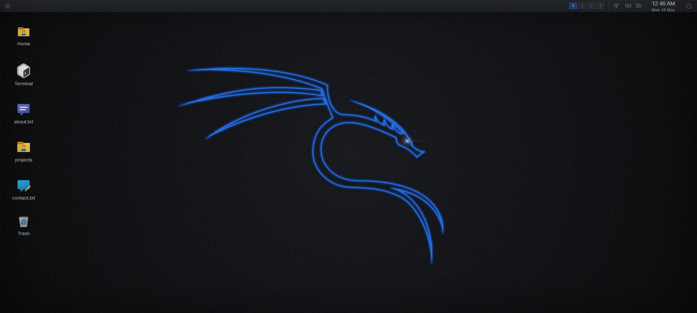

# Kali XFCE Portfolio


<p align="center">
  
</p>

Live Demo: **[https://me.zis3c.dev/](https://me.zis3c.dev/)**

Interactive portfolio that simulates a **Kali Linux XFCE desktop** in browser. Includes boot flow, login screen, draggable windows, terminal emulator, file manager, Mousepad editor, and app launcher behavior.

> [!WARNING]
> This project is a simulation for portfolio and educational use. It is not a real operating system.

## Features

- Kali/XFCE-inspired desktop UI and workflow
- Boot → login → desktop sequence with keyboard navigation
- Login validation
- Workspace switcher and top panel app indicators
- Terminal emulator with custom commands (`ls`, `cat`, `cd`, `whoami`, `uname`, `clear`, `help`, etc.)
- Thunar-style file manager with virtual filesystem ops:
  - new folder, rename, delete (non-empty protection)
- Mousepad-style editor with find/replace and keyboard shortcuts
- Chrome-like in-app browser shell with back/forward navigation
- Notification daemon and panel context actions
- Draggable, resizable windows via `react-rnd`
- Dark theme optimized with custom design-system tokens
- Contact form with validation, rate limiting, and SendGrid email delivery
- Health check endpoint with MongoDB connectivity status
- Security headers, correlation ID tracing, structured logging

## Architecture

```
                    ┌──────────────────────────────────┐
                    │           pages/ (Next.js)         │
                    │  index.tsx   _app.tsx  _document   │
                    │  api/ (health, contact, ...)       │
                    └──────────┬───────────────────────┘
                               │
          ┌────────────────────┼────────────────────┐
          │                    │                    │
   ┌──────▼──────┐   ┌────────▼────────┐   ┌───────▼───────┐
   │ components/ │   │     store/      │   │   backend/    │
   │  Desktop    │   │  Redux slices   │   │ controllers   │
   │  Apps       │   │ + SSR wrapper   │   │ models (DB)   │
   │  Widgets    │   └─────────────────┘   └───────────────┘
   └─────────────┘
          │
   ┌──────┴───────┬──────────────┬──────────────┐
   │  utils/      │  hooks/      │ middleware/   │
   │  filesystem  │  useActions  │  rateLimit    │
   │  logger      │  useHover    │  catchErrors  │
   │  retry       │  ...         │  requestId    │
   └──────────────┴──────────────┴──────────────┘
```

| Layer            | Responsibility                                                                   |
| ---------------- | -------------------------------------------------------------------------------- |
| `pages/`         | Next.js routing, SSR/ISR data fetching, API routes                               |
| `components/`    | Presentational + container components (Desktop, Apps, Widgets)                   |
| `store/`         | Redux state management with `next-redux-wrapper` for SSR hydration               |
| `backend/`       | Mongoose models and controller logic (contact, news)                             |
| `utils/`         | Pure functions: virtual filesystem, logger, retry, error handling                |
| `hooks/`         | Custom React hooks: intersection observer, click-outside, reduced motion         |
| `middleware/`    | API middleware: rate limiting, error catching, correlation IDs, security headers |
| `design-system/` | Theme tokens (colors, spacing, typography, XFCE component tokens)                |

## Stack

- **Framework:** Next.js 14 (Pages Router) with ISR
- **Language:** TypeScript 4.x (strict mode, discriminated unions)
- **State:** Redux + Redux Thunk + `next-redux-wrapper`
- **Styling:** styled-components 6 (dark Kali theme)
- **Database:** MongoDB (Mongoose ODM)
- **Email:** SendGrid
- **Testing:** Jest + Enzyme (unit), Playwright (E2E smoke)
- **Tooling:** ESLint, Prettier, Husky, lint-staged, Commitizen
- **Deployment:** Vercel

## Installation

1. **Clone repository**

   ```bash
   git clone <your-private-repo-url>
   cd Kali-XFCE-Portfolio
   ```

2. **Install dependencies**

   ```bash
   npm install
   ```

3. **Create environment file**

   `.env.local`

   ```env
   DB_URI=your_mongodb_connection_string
   SENDGRID_API_KEY=your_sendgrid_key
   GOOGLE_EMAIL_ADDRESS=your_email@example.com
   ```

   Optional:

   ```env
   NEWS_API_KEY=your_news_api_key
   NEXT_PUBLIC_DEMO_PASSWORD=1234
   ```

4. **Run development server**

   ```bash
   npm run dev
   ```

5. Open:
   - App: `http://localhost:3000`
   - Storybook: `http://localhost:6006`

## Scripts

| Command                 | Description                    |
| ----------------------- | ------------------------------ |
| `npm run dev`           | Start development server       |
| `npm run build`         | Production build               |
| `npm run start`         | Start production server        |
| `npm run lint`          | Run ESLint                     |
| `npm run tsc`           | TypeScript type check          |
| `npm run test`          | Run Jest unit tests            |
| `npm run test:coverage` | Run tests with coverage report |
| `npm run storybook`     | Start Storybook                |
| `npm run cm`            | Commit with Commitizen         |

## Testing

- **Unit tests:** Jest + Enzyme (reducers, utils, middleware, hooks)
- **E2E tests:** Playwright (critical user flow: boot → login → desktop → terminal)

```bash
# Run all unit tests
npm test

# Run with coverage
npm run test:coverage

# Run E2E tests (requires dev server running on port 8888)
npx playwright test e2e/smoke.spec.ts
```

## Project Structure

```text
Kali-XFCE-Portfolio/
├── backend/                  # Controllers, models, DB helpers
├── components/               # Desktop, apps, widgets, portfolio UI
│   └── Apps/                 # Terminal, FileManager, VsCode, TextViewer
├── design-system/            # Theme tokens, global styles, CSS variables
├── e2e/                      # Playwright E2E tests
├── hooks/                    # Custom React hooks
├── middleware/                # API middleware (rate limit, errors, tracing)
├── pages/                    # Next.js pages + API routes
│   └── api/                  # REST API endpoints
├── public/                   # Icons, images, wallpapers, web manifest
├── store/                    # Redux reducers and action creators
├── test/                     # Test utilities and mock store
├── types/                    # TypeScript type definitions
├── utils/                    # Virtual filesystem, logger, retry, env validation
├── README.md
├── jest.config.js
├── tsconfig.json
└── package.json
```

## Login

- Password: configured via `NEXT_PUBLIC_DEMO_PASSWORD` (default: `1234`)

## Notes

- Virtual filesystem writes are in-memory only and persist via `localStorage`.
- Mousepad edits reset after refresh/restart.
- Build on Vercel enables lint/type checking during production build.

## License

MIT
